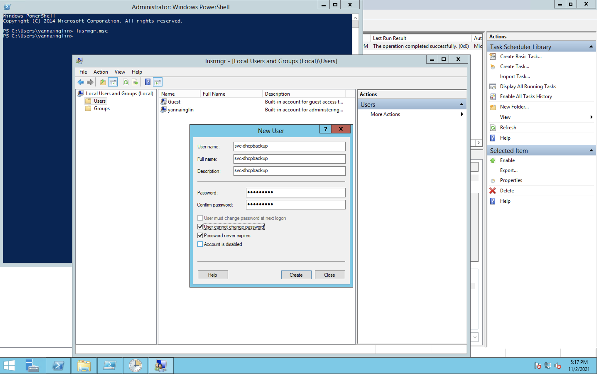
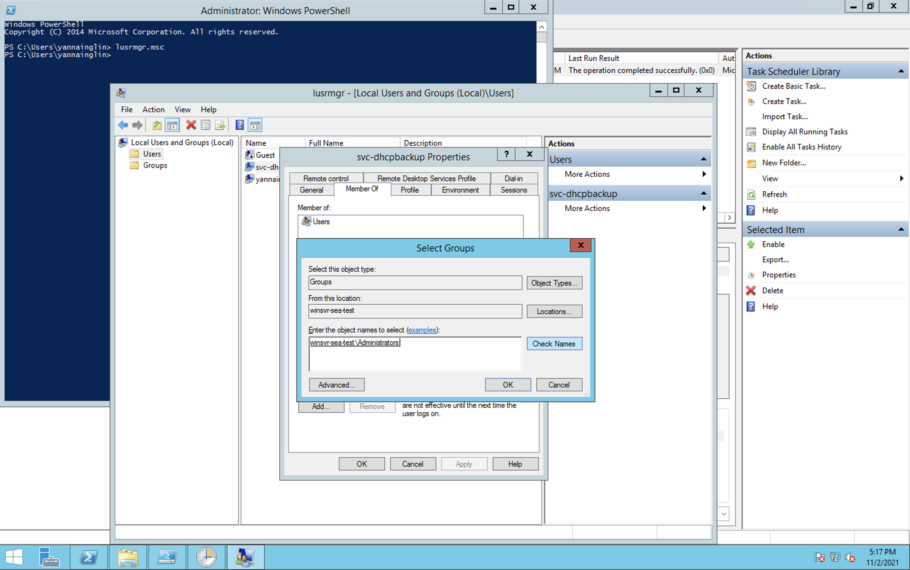
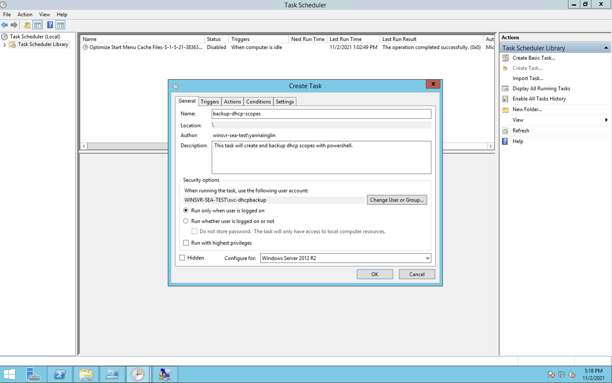
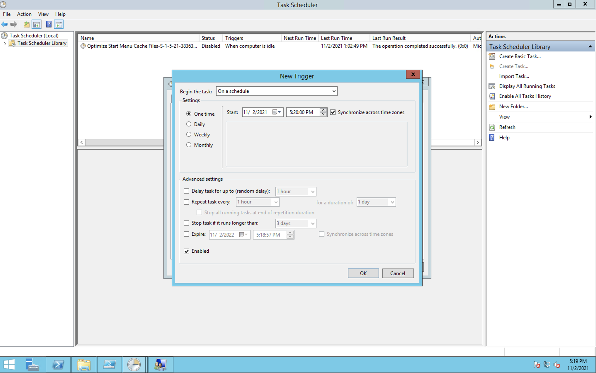
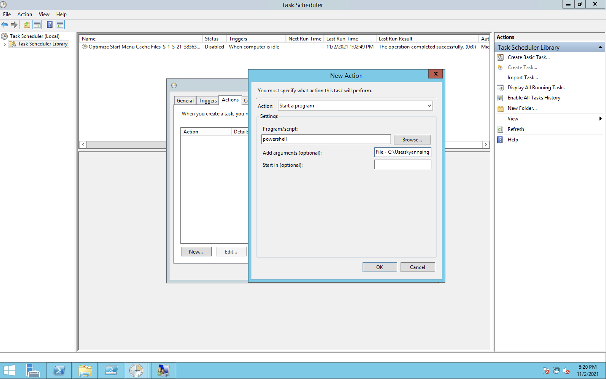
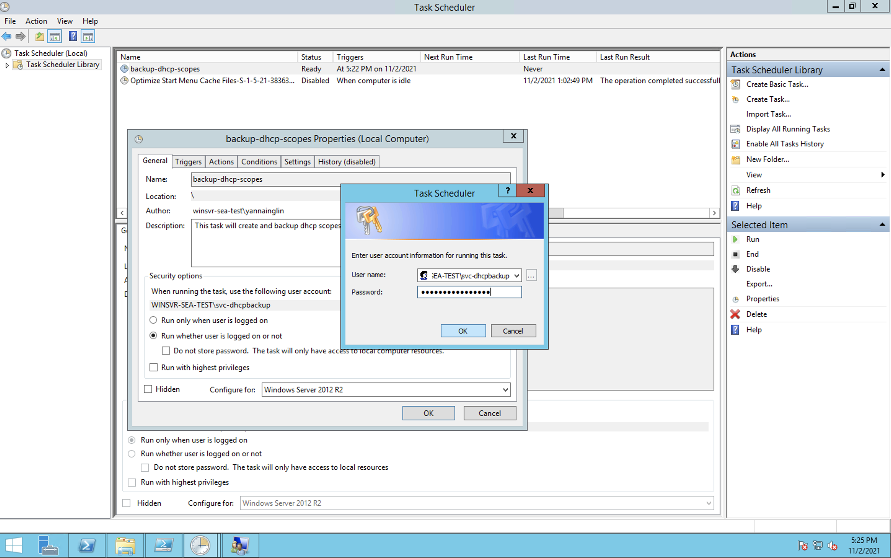
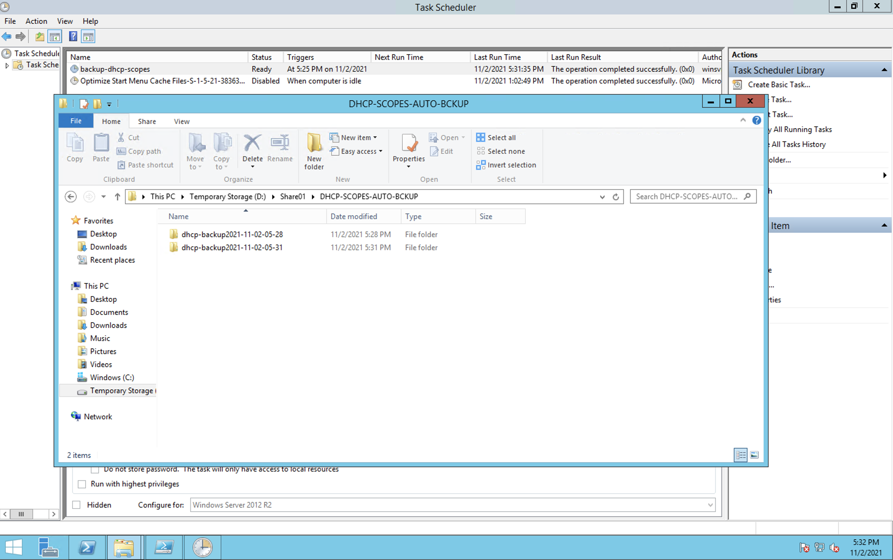

# backup-dhcp-scopes-powershell
## Step by step buckup and delete Microsoft DHCP server scopes with powershell from Windows Task Scheduler

1. Prepare the backup powershell script file. (You can use and refrence powershare file from [here](./backup-dhcp-scopes.ps1))

2. Prepare the delete older 90 days powershell script file. (You can use and refrence powershare file from [here](./delete-dhcp-scopes-auto-90days.ps1))

3. Create service account and grant permission for Windows Task Scheduler.
    * Create sevice account

    

    * Grant Windows Administrator Permission

    


4. Then create windows Task scheduler for respective powershell files.

    *  Create a new task.

        

    * Configure Schedule Time for task.

        

    * Choose and define action for task.(choose program to "powershell" and add File as Argument)
        ```
        -File C:\your-powershell-file-location\your-powershell-file.ps1
        ```

        
    * Choose option for "Run whether user is logined or not" and type service account password which was created previously.

        
5. If the trigger run automatically the backup task will start and you will see back folder under your predefined location.

    

